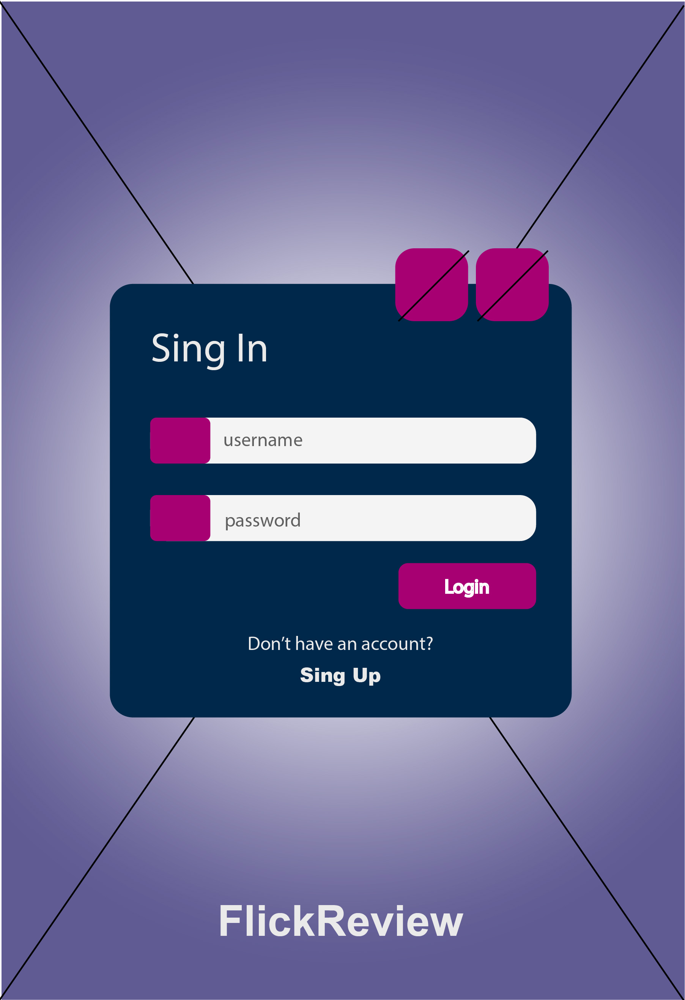
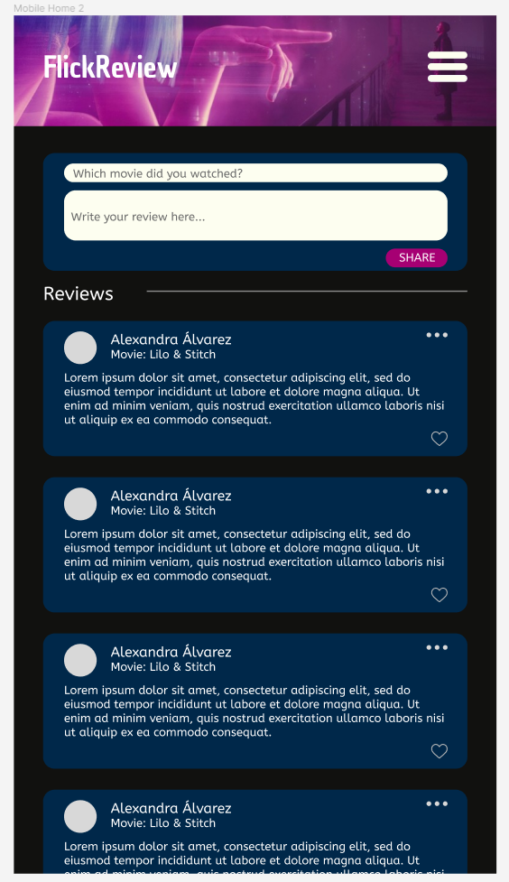
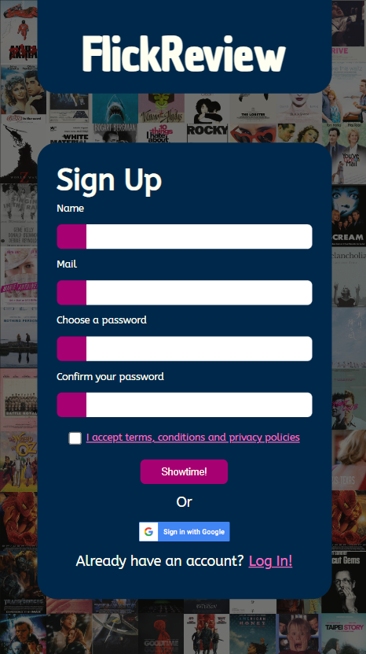
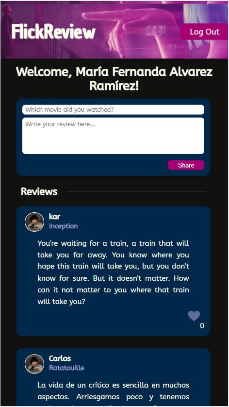

# FlickReview - Una red social para quienes aman el cine

## Índice

* [1. Introducción](#1-introducción)
* [2. Inspiración](#2-inspiración)
* [3. Protipado](#3-prototipado)
* [4. Versión final](#4-versión-final)
* [5. Pruebas de usabilidad](#5-pruebas-de-usabilidad)
* [6. Pruebas unitarias](#6-pruebas-unitarias)
* [7. Créditos y agradecimientos](#7-créditos-y-agradecimientos)

## 1. Introducción

FlickReview es una red social para quienes aman el cine, y no solo eso, sino también disfrutan de compartir con otras personas
sus opiniones respecto a las películas que miran, sin importar de qué género sean, y poder mencionar libremente lo que disfrutaron
y lo que no tanto.

Esta aplicación surgió para poder compartir reseñas, críticas y comentarios sobre cortos y largometrajes a través 
de publicaciones cortas e interactuar con ellas.

## 2. Inspiración

Adaptamos elementos que disfrutamos de otras redes sociales como la implementación de like de Facebook, 
escribir sobre cine en un mismo sitio con distintos usuarios registrados como en Letterboxd y iCheckMovies, 
y finalmente una vista de las publicaciones realizadas por los usuarios similar a Twitter.

La paleta de colores que utilizamos en nuestra aplicación toma como referencia la sensación que evoca estar 
en una sala de cine. Tonos vibrantes como el rosa y el azul que hacen juego con blancos y púrpuras. 

## 3. Prototipado

Se llevaron a cabo prototipados de baja fidelidad en photoshop y alta fidelidad en figma para las secciones de inicio de sesión (log in), 
registro (register) y página principal (home).

## 4. Versión final

Para la versión final de la aplicación, las vistas de login y register están disponibles para quienes accedan al sitio, 
pero para poder realizar y visualizar las publicaciones de otros usuarios registrados es necesario crear una cuenta o iniciar sesión. 

Se realizó el deploy a través de Firebase Hosting y se encuentra disponible [aquí](https://flickreview-labo.web.app/).

## 5. Pruebas de usabilidad

Durante diversas fases del desarrollo se llevaron a cabo pruebas de usabilidad con distintos grupos de usuarios. 
La finalidad de la primera prueba fue conocer si el flujo de navegación para registrarse e iniciar sesión resultaba 
intuitivo para alguien que no estaba familiarizado con la plataforma; también se implementaron los comentarios recibidos
durante estas entrevistas para mejorar la experiencia de uso.

Después se realizaron pruebas para crear publicaciones una vez que el usuario ingresó. 

[Aquí](https://drive.google.com/drive/folders/1ITEjvpeOtdn4RiyqYyzLB0EfyTRORURy?usp=sharing) pueden consultarse los registros.

## 7. Créditos y agradecimientos

Este proyecto fue realizado por Alexandra Álvarez, Fernanda Alvarez y Gabriela Horcasitas.

Gracias a lxs coaches y equipos que nos apoyaron, compartieron sus conocimientos y acompañaron durante este proceso. 
Agradecemos especialmente a Julissa Rodriguez, quien nos direccionó e inspiró durante nuestros momentos de frustración. 

También agradecemos a Michiberto, Mila, Lina, Aysa, Midi y Suavi por vigilarnos mientras trabajabamos para no perder la concentración.