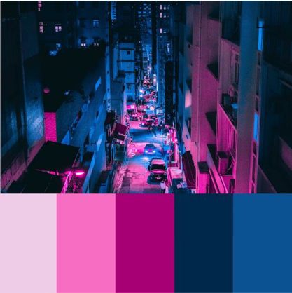
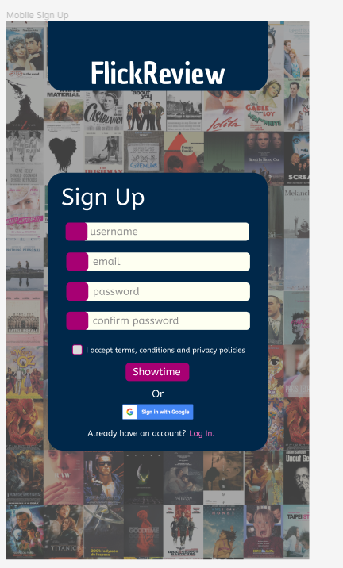

# FlickReview - Una red social para quienes aman el cine

## Índice

* [1. Introducción](#1-introducción)
* [2. Inspiración](#2-inspiración)
* [3. Protipado](#3-prototipado)
* [4. Versión final](#4-versión-final)
* [5. Pruebas de usabilidad](#5-pruebas-de-usabilidad)
* [6. Pruebas unitarias](#6-pruebas-unitarias)
* [7. Créditos y agradecimientos](#7-créditos-y-agradecimientos)

## 1. Introducción

FlickReview es una red social para quienes aman el cine, y no solo eso, sino también disfrutan de compartir con otras personas
sus opiniones respecto a las películas que miran, sin importar de qué género sean, y poder mencionar libremente lo que disfrutaron
y lo que no tanto.

Esta aplicación surgió para poder compartir reseñas, críticas y comentarios sobre cortos y largometrajes a través 
de publicaciones cortas e interactuar con ellas.

## 2. Inspiración

Adaptamos elementos que disfrutamos de otras redes sociales como la implementación de like de Facebook, 
escribir sobre cine en un mismo sitio con distintos usuarios registrados como en Letterboxd y iCheckMovies, 
y finalmente una vista de las publicaciones realizadas por los usuarios similar a Twitter.

La paleta de colores que utilizamos en nuestra aplicación toma como referencia la sensación que evoca estar 
en una sala de cine. Tonos vibrantes como el rosa y el azul que hacen juego con blancos y púrpuras. 

## 3. Prototipado

Se llevaron a cabo prototipados de baja y alta fidelidad para las secciones de inicio de sesión (log in), 
registro (register) y página principal (home).

<!-- 
## 4. Versión final

* Este proyecto se debe trabajar en equipos de tres.

## 5. Pruebas de usabilidad

Permite editar perfil.

## 7. Créditos y agradecimientos

El proyecto será _entregado_ s -->

